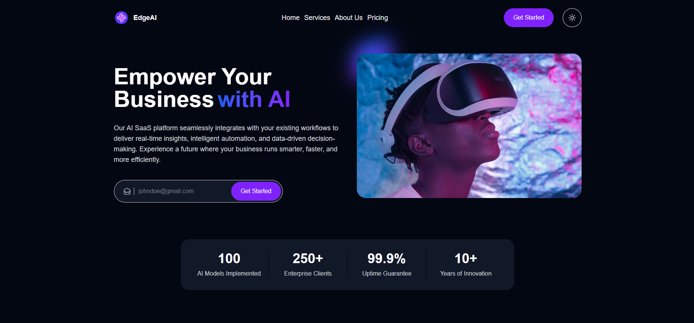

# 🤖 AI SaaS Landing Page

A modern, responsive landing experience for the EdgeAI SaaS platform. Built with React, TypeScript, and Vite, it highlights AI services, customer logos, pricing tiers, and an enterprise-focused CTA backed by a light/dark theme toggle powered by Zustand.

## 🔗 Live Demo

👉 [View Deployed App](https://Rola-Al-Ahmad.github.io/EdgeAI)

---

## 📋 Table of Contents

- [Features](#-features)
- [Tech Stack](#-tech-stack)
- [Project Structure](#-project-structure)
- [Getting Started](#-getting-started)
- [Available Scripts](#-available-scripts)
- [Key Features](#-key-features)
- [Components Overview](#-components-overview)
- [Data Structure](#-data-structure)
- [Routing](#-routing)
- [Styling](#-styling)
- [Contributing](#-contributing)
- [License](#-license)
- [Acknowledgments](#-acknowledgments)

## ✨ Features

### 🎯 Core Functionality

- **Single-page Narrative**: `App.tsx` orchestrates Hero, Brands, Services, About, Pricing, and CTA sections inside a shared `Layout`.
- **Persistent Theme Toggle**: `Navbar` connects to a Zustand store that switches light/dark tokens and remembers the selection in local storage.
- **Hero Conversion Block**: Email capture form, CTA button, and stat cards (`Numbers`) immediately showcase adoption metrics.
- **Client Logos & Social Proof**: `Brands` renders a grayscale hover wall with assets pulled from `/public/assets/logos`.

### 🎨 User Experience

- **Layered Gradients & Glows**: Tailwind utility classes craft neon backgrounds and shadowed cards that echo the AI motif.
- **Responsive Grid System**: Services, metrics, and pricing automatically adapt from single-column to multi-column layouts.
- **Accessible Interactions**: Buttons and inputs ship with clear focus states, enlarged tap targets, and keyboard-friendly forms.
- **Theme-aware Assets**: Scrollbars, typography, and card backgrounds re-style based on the current mode.

### 🔧 Technical Features

- **Type-safe Components**: All UI is authored in `.tsx` with typed props to keep sections consistent.
- **State Management via Zustand**: `ThemeStore.ts` exposes a minimal API for toggling and hydrating theme state.
- **Utility-driven Data**: Services, pricing tiers, and nav links live in `src/utils` for easy edits without touching UI code.
- **Vite + Tailwind 4**: The dev server and Tailwind’s new `@tailwindcss/vite` plugin provide instant feedback with minimal config.

## 🛠 Tech Stack

### Frontend

- **React 19.1.0** – Component-driven UI with hooks.
- **TypeScript 5.8** – Type safety across components and utilities.
- **Vite 6.3** – Fast dev server, optimized production builds.
- **Tailwind CSS 4.1** – Utility-first styling plus custom tokens in `index.css`.
- **Zustand 5** – Lightweight state management for theming.

### Tooling & Quality

- **ESLint 9** – Enforces React, hooks, and refresh rules.
- **@vitejs/plugin-react** – Automatic JSX transform and refresh.
- **PostCSS / Autoprefixer** – Included through Tailwind’s pipeline for cross-browser CSS.

## 📁 Project Structure

```
AI-saas-landing-page/
├── public/
│   └── assets/
│       ├── icon.svg
│       ├── thumbnail.png
│       └── logos/
│           ├── discord.png
│           ├── paypal.png
│           ├── slack.png
│           ├── spotify.png
│           ├── uber.png
│           └── youtube.png
├── src/
│   ├── components/
│   │   ├── Layout.tsx
│   │   ├── cards/
│   │   │   ├── Info.tsx
│   │   │   └── Service.tsx
│   │   ├── elements/
│   │   │   ├── Footer.tsx
│   │   │   └── Navbar.tsx
│   │   ├── sections/
│   │   │   ├── AboutUs.tsx
│   │   │   ├── Brands.tsx
│   │   │   ├── CallToAction.tsx
│   │   │   ├── Hero.tsx
│   │   │   ├── Numbers.tsx
│   │   │   ├── Pricing.tsx
│   │   │   └── Services.tsx
│   │   └── shared/
│   │       ├── BtnLink.tsx
│   │       ├── Button.tsx
│   │       ├── Container.tsx
│   │       ├── NavItem.tsx
│   │       ├── Paragraph.tsx
│   │       └── Title.tsx
│   ├── store/ThemeStore.ts
│   ├── utils/
│   │   ├── nav-items.ts
│   │   ├── pricing-plan.ts
│   │   └── services-data.tsx
│   ├── App.tsx
│   ├── index.css
│   └── main.tsx
├── package.json
├── tsconfig*.json
├── vite.config.ts
└── README.md
```

## 🚀 Getting Started

### Prerequisites

- Node.js 18+
- npm (bundled with Node)

### Installation

1. **Clone the repository**
   ```bash
   git clone <repository-url>
   cd AI-saas-landing-page
   ```
2. **Install dependencies**
   ```bash
   npm install
   ```
3. **Start the dev server**
   ```bash
   npm run dev
   ```
4. **Open the app**
   Visit `http://localhost:5173` in your browser.

## 📜 Available Scripts

| Script            | Description                         |
| ----------------- | ----------------------------------- |
| `npm run dev`     | Starts the Vite dev server          |
| `npm run build`   | Type-checks then builds for prod    |
| `npm run lint`    | Runs ESLint across TS/TSX files     |
| `npm run preview` | Serves the production build locally |

## 🎯 Key Features

### 🏠 Hero & Navigation

- Sticky `Navbar` with anchor links sourced from `nav-items.ts` plus a theme toggle button.
- Hero copy block, gradient headline, and email capture form focused on AI adoption messaging.
- `Numbers` card row highlights models shipped, enterprise clients, uptime, and innovation years.

### 🤝 Brands & Services

- `Brands` component showcases partner logos with grayscale-to-color hover transitions.
- `Services` grid pulls icon, title, and description data from `services-data.tsx` for consistency.

### 🧭 About & Pricing

- `AboutUs` reinforces differentiators with stacked cards and supporting copy.
- `Pricing` iterates over plans from `pricing-plan.ts` to render tiered CTAs.

### 🚀 Call to Action

- `CallToAction` closes the page with a gradient banner, reinforcing a single “Get Started” path.

## 🧩 Components Overview

- **Layout**: Sets the page title, wraps sections with a shared navbar and footer.
- **Navbar/Footer**: Navigation, CTA link, theme toggle, and supporting links.
- **Hero / Brands / Services / AboutUs / Pricing / CallToAction**: Section-specific storytelling blocks.
- **Cards**: `Service` and `Info` components ensure consistent visuals and spacing.
- **Shared Elements**: `Container`, `Button`, `Title`, `Paragraph`, and `NavItem` maintain typography and spacing tokens.

## 📊 Data Structure

- **`nav-items.ts`**: Controls header links and anchor targets.
- **`services-data.tsx`**: Defines service cards with icon components and copy.
- **`pricing-plan.ts`**: Provides tier metadata used by `Pricing`.
- **Assets**: Logos and hero thumbnail are stored in `public/assets` for straightforward updates.

## 🛣 Routing

- Single-page layout with anchor-based navigation; no external router is required.
- Smooth scrolling is enabled globally in `index.css` for better section transitions.

## 🎨 Styling

- **Tailwind CSS 4** powers utility-first styling with custom theme tokens defined via `@theme`.
- **Custom CSS (`index.css`)** extends Tailwind with scrollbar styling, font declarations, and color variables synced to the theme toggle.
- **Responsive Strategy** leverages Tailwind breakpoints (`sm`, `md`, `lg`, `xl`) to switch between column counts and spacing.

## 🤝 Contributing

1. Fork the repo.
2. Create a feature branch (`git checkout -b feature/amazing-feature`).
3. Commit your changes (`git commit -m "Add amazing feature"`).
4. Push the branch (`git push origin feature/amazing-feature`).
5. Open a Pull Request describing your updates.

### Code Style Guidelines

- Follow the existing ESLint + TypeScript rules.
- Favor descriptive component/prop names and keep components focused.
- Store shared helpers and datasets under `src/utils`.
- Use Tailwind utilities whenever possible before adding custom CSS.

## 📝 License

No explicit license has been provided yet. Add one (e.g., MIT) if you plan to distribute the project widely.

## 🙏 Acknowledgments

- **React + Vite teams** for the modern DX.
- **Tailwind CSS** for utility-first styling.
- **Zustand** for a tiny yet powerful state store.
- **Pexels** for the hero imagery inspiration.

---

**AI SaaS Landing Page** – Helping teams ship smarter, faster, and more secure AI products.
